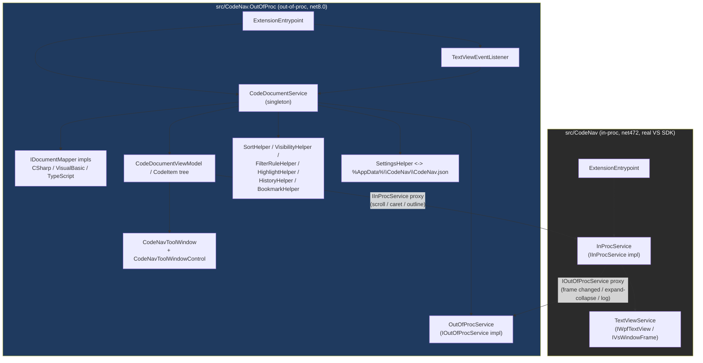

# CodeNav — Architecture (Phase 1)

> Generated by reading the code, following call chains from entry points outward.
> Every claim below is backed by a `path:line` reference. Anything I could not verify
> from the code is listed in **Neisté / neoverené** at the end.

## 0. Two projects, one VSIX

This is **not** the classic single-VSPackage VSIX. It is a *composite* extension built on
the new `Microsoft.VisualStudio.Extensibility` (out-of-proc) SDK, made of two projects that
get merged into one `.vsix`:

- **`src/CodeNav`** ("in-proc" / "CompositeExtension") — `net472`, `UseWPF=true`,
  `VssdkCompatibleExtension=true` (`src/CodeNav/CodeNav.csproj:3,7,9`). This is the only part
  allowed to touch classic VS SDK types (`IVsTextView`, `IWpfTextView`, `IVsWindowFrame`, …)
  because it still runs in the main VS process.
- **`src/CodeNav.OutOfProc`** — `net8.0-windows8.0` (`src/CodeNav.OutOfProc/CodeNav.OutOfProc.csproj:3`),
  runs in a separate out-of-proc extension host process, and contains almost all of the
  actual logic: Roslyn parsing, the view models, the tool window, settings, filtering, sorting.
  `CreateVsixContainer=false` (`CodeNav.OutOfProc.csproj:17`) — it never ships its own VSIX,
  it is packaged *into* `CodeNav`'s VSIX via a `ProjectReference` with
  `IncludeInVSIX=true` (`src/CodeNav/CodeNav.csproj:45-50`), landing in an `OutOfProc`
  subfolder (`AssemblyVSIXSubPath` in `CodeNav.OutOfProc.csproj:13`).

The two processes talk to each other over **brokered services** (VS's cross-process RPC),
not direct method calls — see §4.

## 1. VSIX manifest & entry points

- `src/CodeNav/source.extension.vsixmanifest:14` declares
  `ExtensionType="VSSDK+VisualStudio.Extensibility"` — confirms the hybrid model. Installed
  into VS 2022+/2026 (`Version="[17.14,)"`, `source.extension.vsixmanifest:15-20`).
- There is **no classic `AsyncPackage`/`Package` class anywhere** in this codebase — the
  extension is bootstrapped purely through `[VisualStudioContribution]`-attributed classes
  that derive from `Extension`. This is the "extension entrypoint" pattern of the new SDK.
- Two `ExtensionEntrypoint` classes, one per process:
  - `src/CodeNav/ExtensionEntrypoint.cs:11-31` (in-proc). `LoadedWhen` activates it only when
    the active editor content type is `CSharp|Basic|TypeScript`
    (`src/CodeNav/ExtensionEntrypoint.cs:17`). It registers `InProcService` as a brokered
    service (`ExtensionEntrypoint.cs:23`) and `TextViewService` as a scoped DI service
    (`ExtensionEntrypoint.cs:29`).
  - `src/CodeNav.OutOfProc/ExtensionEntrypoint.cs:11-42` (out-of-proc). Registers
    `OutOfProcService` as a brokered service (`ExtensionEntrypoint.cs:31`),
    `CodeDocumentService` as a **singleton** — explicitly commented as "single source of
    truth for the code document" (`ExtensionEntrypoint.cs:33-34`) — and `OutputWindowService`,
    `OutliningService`, `WindowFrameService` as scoped services (`ExtensionEntrypoint.cs:36-40`).

## 2. Tool window & UI layer

- `src/CodeNav.OutOfProc/ToolWindows/CodeNavToolWindow.cs:8-30` — a `[VisualStudioContribution]`
  `ToolWindow`. `InitializeAsync` stashes a reference to itself on the singleton
  `CodeDocumentService.ToolWindow` (`CodeNavToolWindow.cs:23`) so services can show/hide it
  later. `GetContentAsync` returns a `CodeNavToolWindowControl` whose data context is
  `codeDocumentService.CodeDocumentViewModel` (`CodeNavToolWindow.cs:28-29`) — i.e. the tool
  window UI is just a remote WPF view bound to that one shared view model.
- `src/CodeNav.OutOfProc/ToolWindows/CodeNavToolWindowCommand.cs:6-22` — the
  "Extensions menu" command (`CommandPlacement.KnownPlacements.ExtensionsMenu`,
  `CodeNavToolWindowCommand.cs:11`) that opens the tool window on demand.
- `src/CodeNav.OutOfProc/ToolWindows/CodeNavToolWindowControl.cs:5-16` — a
  `RemoteUserControl` (WPF rendered out-of-proc, streamed into VS's UI via
  `IRemoteUserControl`). It wires up 5 embedded XAML resource dictionaries: item context
  menu, highlight style, toolbar styles, expander styles, and the per-`CodeItemKindEnum`
  item templates (`CodeItemStyles.xaml`) (`CodeNavToolWindowControl.cs:10-14`). The actual
  `.xaml` markup lives alongside these `.cs` files but wasn't opened in this pass — see
  Neisté.
- The tree itself is data-bound to `CodeDocumentViewModel.CodeItems`
  (`src/CodeNav.OutOfProc/ViewModels/CodeDocumentViewModel.cs:55-66`), a flat
  `List<CodeItem>` where nesting comes from items that implement `IMembers`
  (`src/CodeNav.OutOfProc/Interfaces/IMembers.cs:5-10`: `Members` + `IsExpanded`).
  `CodeDocumentViewModel` also exposes all toolbar commands (sort/filter/expand/settings) as
  `AsyncCommand` `[DataMember]` properties (`CodeDocumentViewModel.cs:22-33`), and
  `CodeItem` exposes the per-item commands (click, double-click, go to definition, bookmark,
  copy name, …) the same way (`src/CodeNav.OutOfProc/ViewModels/CodeItem.cs:20-33`).

## 3. Parsing layer — source → model

Multi-language, one mapper implementation per language, selected polymorphically:

- `src/CodeNav.OutOfProc/Interfaces/IDocumentMapper.cs:7-18` — the extension point:
  `CanMapDocument(filePath, settings)` and
  `MapDocument(text, excludeFilePath, codeDocumentViewModel, extensibility, ct) → List<CodeItem>`.
- `src/CodeNav.OutOfProc/Services/CodeDocumentService.cs:23-28` builds a fixed list of three
  mappers: C# `Languages/CSharp/Mappers/DocumentMapper`, VB
  `Languages/VisualBasic/Mappers/DocumentMapper`, TypeScript
  `Languages/TypeScript/Mappers/DocumentMapper`. In
  `UpdateCodeDocumentViewModel` (`CodeDocumentService.cs:93-95`) the first mapper whose
  `CanMapDocument` returns true is used (`FirstOrDefault`).
  - C#: `CanMapDocument` = `settings.EnableCSharp && filePath.EndsWith(".cs")`
    (`Languages/CSharp/Mappers/DocumentMapper.cs:143-147`).
  - TypeScript: `settings.EnableTypeScript && !path.EndsWith(".d.ts") && (.ts or .tsx)`
    (`Languages/TypeScript/Mappers/DocumentMapper.cs:42-48`).
  - VB has the analogous pattern in `Languages/VisualBasic/Mappers/DocumentMapper.cs`
    (not opened in detail this pass).
- **C# mapper** (`Languages/CSharp/Mappers/DocumentMapper.cs`) uses live Roslyn:
  `CSharpSyntaxTree.ParseText(text)` (`DocumentMapper.cs:60`), then builds a throwaway
  `CSharpCompilation` out of every other `.cs` file in the solution (obtained via
  `extensibility.Workspaces().QueryProjectsAsync(...)`,
  `DocumentMapper.cs:30-37`) plus the current buffer, to get a `SemanticModel`
  (`GetCSharpSemanticModel`, `DocumentMapper.cs:76-98`) — this is what lets it resolve base
  classes/implemented interfaces across files. It walks `root.Members` and dispatches per
  `SyntaxKind` in a big switch, `MapMember` (`DocumentMapper.cs:100-141`), to per-kind mapper
  classes (`ClassMapper`, `MethodMapper`, `PropertyMapper`, `InterfaceMapper`,
  `EnumMapper`, `RegionMapper`, …, all in `Languages/CSharp/Mappers/`). Class-level mapping
  (`Languages/CSharp/Mappers/ClassMapper.cs:14-60`) recurses into `member.Members`, handles
  region grouping (`RegionMapper.AddToRegion`) and interface-member deduplication
  (`InterfaceMapper.IsPartOfImplementedInterface`).
  - Shared per-item field mapping (name, full name, span, access modifier, id, tooltip) lives
    in `Languages/CSharp/Mappers/BaseMapper.cs:24-52` (`MapBase<T>`), used by every C# kind
    mapper via generics.
  - `MapBase` also computes `OutlineSpan` (`BaseMapper.cs:47-49,61-76`) — the span used to
    sync with VS's outlining/collapsing regions later (§4).
- **TypeScript mapper** is structurally different and explicitly documented as such: no
  semantic model, no cross-file compilation — "just a structural scan of the current
  document" (`Languages/TypeScript/Mappers/DocumentMapper.cs:14-17`). It uses a hand-rolled
  `TypeScriptParser.Parse(text)` (`Languages/TypeScript/Parsing/TypeScriptParser.cs`) →
  `TypeScriptNode` tree → `CodeItemMapper.MapNodes(...)`
  (`Languages/TypeScript/Mappers/DocumentMapper.cs:31-37`).
- Output model: `List<CodeItem>` where `CodeItem`
  (`src/CodeNav.OutOfProc/ViewModels/CodeItem.cs:16-497`) is the base view-model class for
  every tree node (name, kind, access, span, icon monikers, commands, highlight/bookmark
  state...), and subclasses add kind-specific data/children:
  `CodeClassItem`, `CodeFunctionItem`, `CodeInterfaceItem`, `CodeNamespaceItem`,
  `CodePropertyItem`, `CodeRegionItem` (all in `ViewModels/`). Container kinds implement
  `IMembers` for recursive nesting (`Interfaces/IMembers.cs`).
- `CodeItemKindEnum` (`src/CodeNav.OutOfProc/Constants/CodeItemKindEnum.cs:5-79`) enumerates
  every structural kind (Namespace, Class, Method, Property, Enum, Region, Switch, ...) and
  carries an `[EnumOrder(n)]` used by "sort by type" (`Helpers/SortHelper.cs:118-134`, order
  read via `codeItem.Kind.GetEnumOrder()`, `SortHelper.cs:121`).

## 4. Editor events → UI

- `src/CodeNav.OutOfProc/TextViewEventListener.cs:20-37` is a `[VisualStudioContribution]`
  `ITextViewOpenClosedListener, ITextViewChangedListener` scoped to `**/*.{cs,vb}` documents
  (`TextViewEventListener.cs:35`) — **note: the glob does not include `.ts`/`.tsx`**, see
  Neisté §.
  - `TextViewOpenedAsync` (`TextViewEventListener.cs:116-141`): loads settings, checks the
    line-count auto-load threshold, then calls
    `CodeDocumentService.UpdateCodeDocumentViewModel(...)`.
  - `TextViewChangedAsync` (`TextViewEventListener.cs:40-98`): same threshold check, then —
    if the document was actually edited and "update while typing" is on, or the file path
    changed (tab switch) — calls `UpdateCodeDocumentViewModel` through a 300 ms
    `DebounceDispatcher` (`TextViewEventListener.cs:28,64-74`) to coalesce keystrokes. It also
    separately updates the "history" edit indicators (`HistoryHelper.AddItemToHistory`,
    `TextViewEventListener.cs:78-82`) and, on caret line change, triggers highlighting of the
    current item (`HighlightHelper.HighlightCurrentItem`, `TextViewEventListener.cs:84-92`).
  - `TextViewClosedAsync` (`TextViewEventListener.cs:101-113`): shows a placeholder and hides
    the tool window.
- `CodeDocumentService.UpdateCodeDocumentViewModel`
  (`src/CodeNav.OutOfProc/Services/CodeDocumentService.cs:76-197`) is the central pipeline
  once a mapper has produced `codeItems`: sort (`SortHelper.Sort`, line 148) → unhighlight
  (`HighlightHelper.UnHighlight`, line 153) → apply visibility from filters/search/bookmarks
  (`VisibilityHelper.SetCodeItemVisibility`, line 158) → apply filter-rule styling
  (`FilterRuleHelper.ApplyFilterRules`, line 168) → apply history indicators (line 173) →
  apply bookmark indicators (line 178) → sync outline/collapse state
  (`OutliningService.SubscribeToRegionEvents`, line 183) → subscribe to active-window-frame
  changes (`windowFrameService.SubscribeToWindowFrameEvents`, line 187).
- **Cross-process plumbing for editor interaction** (this is why there are two brokered
  service interfaces):
  - Out-of-proc → in-proc: `IOutOfProcService`
    (`src/CodeNav.OutOfProc/Services/IOutOfProcService.cs:5-16`, e.g.
    `SetCodeItemIsExpanded`, `ProcessActiveFrameChanged`, `LogException`) — implemented by
    `OutOfProcService` (out-of-proc side) and called *from* in-proc code
    (`src/CodeNav/Services/InProcService.cs` calls it constantly to report back, e.g. lines
    104-105, 133-134, 366-367).
  - In-proc → out-of-proc: `IInProcService`
    (`src/CodeNav.OutOfProc/Services/IInProcService.cs`, mirrored/linked into
    `src/CodeNav/Services/IInProcService.cs` via the `<Compile Include>` link in
    `CodeNav.OutOfProc.csproj:31`) — implemented by `InProcService`
    (`src/CodeNav/Services/InProcService.cs:17`), which is what actually touches
    `IWpfTextView`/`IVsTextView`/`IOutliningManager` via classic VS SDK
    (`TextViewService`, `src/CodeNav/Services/TextViewService.cs`). Clicking a tree item
    (`CodeItem.ClickItem`, `ViewModels/CodeItem.cs:264-295`) gets a proxy to `IInProcService`
    over `clientContext.Extensibility.ServiceBroker` (`CodeItem.cs:274-276`) and calls
    `TextViewScrollToSpan` (`CodeItem.cs:281`) — which round-trips into the in-proc process to
    actually scroll the real WPF editor (`InProcService.cs:317-318` → `TextViewService.cs:41-84`).
  - `InProcService` also subscribes to VS's `IVsWindowFrameEvents`
    (`src/CodeNav/Services/InProcService.cs:17,332-339`) to detect active-document changes
    that aren't plain text-view edits (e.g. switching to a different open document), and
    forwards that back out-of-proc via `IOutOfProcService.ProcessActiveFrameChanged`
    (`InProcService.cs:363-404`).
  - Outlining sync is bidirectional: expanding/collapsing a code item in the tool window
    (`CodeItem.DoubleClickItem` → `IInProcService.TextViewMoveCaretToPosition`, or the
    Expand/Collapse-All commands via `OutliningService`) round-trips to
    `InProcService.ExpandOutlineRegion`/`CollapseOutlineRegion`
    (`InProcService.cs:159-244`); and manually expanding/collapsing a `#region` in the editor
    raises `IOutliningManager.RegionsExpanded/RegionsCollapsed`
    (`InProcService.cs:69-73,101-150`), which calls back out-of-proc via
    `IOutOfProcService.SetCodeItemIsExpanded` to keep the tree in sync.

## 5. Settings / options

- No classic `DialogPage`/Tools→Options integration. Settings are a **plain JSON file on
  disk**, not VS's settings store:
  - `src/CodeNav.OutOfProc/Helpers/SettingsHelper.cs:9-13` —
    `%AppData%\CodeNav\CodeNav.json`.
  - `SaveGlobalSettings`/`LoadGlobalSettings` (`SettingsHelper.cs:18-64`) serialize/deserialize
    `GlobalSettings` (`src/CodeNav.OutOfProc/Models/GlobalSettings.cs:5-65`) with
    `Newtonsoft.Json`.
- `CodeDocumentService.GlobalSettings` (`Services/CodeDocumentService.cs:60`) is the in-memory
  cache; `LoadGlobalSettings(readFromDisk)` (`CodeDocumentService.cs:199-279`) lazily loads it
  once (`GlobalSettings ??= ...`, line 208) unless forced, then re-derives
  `SettingsDialogData` (line 210-223), `FilterDialogData` (line 239-241), and re-applies
  visibility/sort to the current `CodeDocumentViewModel` (lines 267-273) — i.e. settings
  changes are pushed into the already-rendered tree without a full re-parse.
  - `SettingsDialogData`/`FilterDialogData` are separate DTOs bound to the two dialogs (
    `Dialogs/SettingsDialog/SettingsDialogControl.xaml`,
    `Dialogs/FilterDialog/FilterDialogControl.xaml`), opened via
    `Extensibility.Shell().ShowDialogAsync(...)` from
    `CodeDocumentViewModel.Settings`/`.Filter`
    (`ViewModels/CodeDocumentViewModel.cs:230-271,282-327`). On OK, values are copied back
    into `GlobalSettings` and persisted with `SettingsHelper.SaveGlobalSettings`
    (`CodeDocumentViewModel.cs:250-262,305-320`), then the view is refreshed.
  - Read at runtime by: `TextViewEventListener` (auto-load threshold, update-while-typing,
    history, auto-highlight — `TextViewEventListener.cs:44,47-48,61,79,87`),
    `CodeDocumentService` (per-language `CanMapDocument` checks, show/hide tool window —
    `CodeDocumentService.cs:95,288,303`), `SortHelper`/`FilterRuleHelper`/`VisibilityHelper`
    (sort order, filter rules).
- Sort order and filter rules are themselves persisted inside `GlobalSettings`
  (`SortOrder`, `FilterRules` — `Models/GlobalSettings.cs:59,64`), not in the separate
  dialogs' own files.

## Data flow, end to end (document open/edit → rendered tree)

1. User opens or edits a `.cs`/`.vb` file. VS raises text-view events; the out-of-proc host
   dispatches to `TextViewEventListener.TextViewOpenedAsync` /
   `.TextViewChangedAsync` (`TextViewEventListener.cs:40,116`).
2. Listener loads/refreshes `GlobalSettings` (`CodeDocumentService.LoadGlobalSettings`,
   `CodeDocumentService.cs:199`), checks the auto-load line threshold, and (debounced 300 ms
   for edits) calls `CodeDocumentService.UpdateCodeDocumentViewModel(...)`
   (`CodeDocumentService.cs:76`).
3. `UpdateCodeDocumentViewModel` picks the first `IDocumentMapper` whose `CanMapDocument`
   matches the file (`CodeDocumentService.cs:93-95`), shows a transient "loading" placeholder
   (line 112), and calls `documentMapper.MapDocument(...)` (line 118).
4. The mapper parses text with the language's parser (Roslyn for C#/VB, a hand-rolled scanner
   for TypeScript), builds a semantic model when needed (C#/VB only), and walks the syntax
   tree recursively, producing a `List<CodeItem>` tree via per-kind mapper classes
   (`Languages/CSharp/Mappers/DocumentMapper.cs:100-141` and siblings).
5. Back in `UpdateCodeDocumentViewModel`: sort (`SortHelper.Sort`) → un-highlight → visibility
   from filters/search/bookmarks (`VisibilityHelper`) → filter-rule styling
   (`FilterRuleHelper`) → history indicators → bookmark indicators → outline-state sync
   (`OutliningService.SubscribeToRegionEvents`, which round-trips in-proc to read live
   `#region`/collapsed state) (`CodeDocumentService.cs:146-187`).
6. `CodeDocumentViewModel.CodeItems` is set (`CodeDocumentService.cs:148`), which raises
   `PropertyChanged` (`ViewModels/CodeDocumentViewModel.cs:60-66`) and updates the bound
   `RemoteUserControl` in the `CodeNavToolWindow` (`ToolWindows/CodeNavToolWindow.cs:28-29`) —
   the WPF tree re-renders using `CodeItemStyles.xaml`'s per-`CodeItemKindEnum` templates.
7. Clicking an item invokes `CodeItem.ClickItem` (`ViewModels/CodeItem.cs:264-295`), which
   gets an `IInProcService` proxy over the service broker and calls
   `TextViewScrollToSpan`/caret-move — this crosses back into the in-proc process
   (`src/CodeNav/Services/InProcService.cs` → `TextViewService.cs`) to actually move the real
   editor caret/selection, and records the click in navigation history.

## Main components

| Component | File:Line | Responsibility |
|---|---|---|
| `ExtensionEntrypoint` (in-proc) | `src/CodeNav/ExtensionEntrypoint.cs:11` | Registers in-proc DI/brokered services; activation constraint on editor content type |
| `ExtensionEntrypoint` (out-of-proc) | `src/CodeNav.OutOfProc/ExtensionEntrypoint.cs:11` | Registers out-of-proc DI/brokered services incl. singleton `CodeDocumentService` |
| `TextViewEventListener` | `src/CodeNav.OutOfProc/TextViewEventListener.cs:20` | Reacts to document open/change/close; debounces re-parse; triggers highlight/history updates |
| `CodeDocumentService` | `src/CodeNav.OutOfProc/Services/CodeDocumentService.cs:17` | Central pipeline: pick mapper → map → sort/filter/visibility/highlight/history/bookmark/outline → show/hide tool window; owns `GlobalSettings` cache |
| `CodeDocumentViewModel` | `src/CodeNav.OutOfProc/ViewModels/CodeDocumentViewModel.cs:17` | Single DataContext for the tool window; holds `CodeItems`, toolbar commands, filter/sort state |
| `CodeItem` (+ subclasses) | `src/CodeNav.OutOfProc/ViewModels/CodeItem.cs:16` | Per-node view model: display state + navigation/bookmark/history commands |
| `IDocumentMapper` + per-language `DocumentMapper` | `src/CodeNav.OutOfProc/Interfaces/IDocumentMapper.cs:7`, `Languages/{CSharp,VisualBasic,TypeScript}/Mappers/DocumentMapper.cs` | Extension point: text → `List<CodeItem>` for one language |
| Per-kind mappers (`ClassMapper`, `MethodMapper`, ...) | `src/CodeNav.OutOfProc/Languages/CSharp/Mappers/*.cs` | Map one Roslyn syntax kind to one `CodeItem` subtype |
| `CodeNavToolWindow` / `...Control` | `src/CodeNav.OutOfProc/ToolWindows/CodeNavToolWindow.cs:8`, `CodeNavToolWindowControl.cs:5` | Tool window contribution + remote WPF UI host |
| `CodeNavToolWindowCommand` | `src/CodeNav.OutOfProc/ToolWindows/CodeNavToolWindowCommand.cs:7` | Extensions-menu command that opens the tool window |
| `IOutOfProcService` / `OutOfProcService` | `src/CodeNav.OutOfProc/Services/IOutOfProcService.cs:5` | Brokered RPC surface called *from* the in-proc process (logging, frame-change, expand/collapse notifications) |
| `IInProcService` / `InProcService` | `src/CodeNav.OutOfProc/Services/IInProcService.cs`, `src/CodeNav/Services/InProcService.cs:17` | Brokered RPC surface called *from* the out-of-proc process to touch the real editor (scroll, caret move, outlining) |
| `TextViewService` | `src/CodeNav/Services/TextViewService.cs:16` | In-proc-only: classic VS SDK access to `IWpfTextView`/`IVsWindowFrame` |
| `SettingsHelper` / `GlobalSettings` | `src/CodeNav.OutOfProc/Helpers/SettingsHelper.cs:7`, `Models/GlobalSettings.cs:5` | JSON persistence of all user settings at `%AppData%\CodeNav\CodeNav.json` |
| `SortHelper` | `src/CodeNav.OutOfProc/Helpers/SortHelper.cs:11` | Sort-by-file/name/type, recursive over `IMembers` |
| `VisibilityHelper` / `FilterRuleHelper` | `Helpers/VisibilityHelper.cs:8`, `Helpers/FilterRuleHelper.cs:9` | Search/filter-rule driven visibility, opacity, italics |
| `IconMapper` | `src/CodeNav.OutOfProc/Mappers/IconMapper.cs:7` | `CodeItemKindEnum` + access → VS `ImageMoniker` |
| `CodeItemKindEnum` | `src/CodeNav.OutOfProc/Constants/CodeItemKindEnum.cs:5` | All structural kinds + sort-order metadata (`[EnumOrder]`) |

## Dependency diagram

## Where the project can be extended

- **New language support**: implement `IDocumentMapper`
  (`src/CodeNav.OutOfProc/Interfaces/IDocumentMapper.cs:7-18`) and register it in the list in
  `CodeDocumentService` (`src/CodeNav.OutOfProc/Services/CodeDocumentService.cs:23-28`).
  `CanMapDocument` is where the file-extension/setting gate goes (pattern:
  `Languages/CSharp/Mappers/DocumentMapper.cs:143-147`). Also required, easy to miss (found the
  hard way while adding SQL support): add the new document's editor **content type name** to
  `IsSupportedLanguage` in `src/CodeNav/Services/TextViewService.cs:249-259` — this in-proc,
  classic-VS-SDK gate is what actually allows `ScrollToSpan`/`MoveCaretToPosition` (i.e. click
  navigation) to do anything; without it, clicks silently no-op (only visible via a logged
  exception in the CodeNav/Extensions Output window: `"Active text view is not in a supported
  language editor. '{ContentType.TypeName}'"`, `TextViewService.cs:58`, which conveniently
  reveals the exact content type string to add). The content type name is whatever the actual
  editor for that extension registers (e.g. `.sql` was `"SQL Server Tools"` here because SSDT
  was installed, not the more obvious `"SQL"`) and must be confirmed by running, not guessed.
- **New structural item kind**: add a value to `CodeItemKindEnum`
  (`src/CodeNav.OutOfProc/Constants/CodeItemKindEnum.cs:5-79`, with `[EnumOrder(n)]` for
  "sort by type"), add a mapper case in the relevant `DocumentMapper.MapMember` switch
  (e.g. `Languages/CSharp/Mappers/DocumentMapper.cs:104-141`), an icon mapping in
  `IconMapper.MapMoniker` (`src/CodeNav.OutOfProc/Mappers/IconMapper.cs:9-47`), and a
  matching item template in `ToolWindows/Templates/CodeItemStyles.xaml` (not opened this
  pass — see Neisté).
- **New per-item toolbar/context-menu action**: add a `[DataMember] AsyncCommand` to
  `CodeItem` (pattern in `src/CodeNav.OutOfProc/ViewModels/CodeItem.cs:20-33,261-402`) and
  wire it into `ToolWindows/Templates/ItemContextMenu.xaml`.
- **New global setting**: add a property to `GlobalSettings`
  (`src/CodeNav.OutOfProc/Models/GlobalSettings.cs:5-65`), mirror it into
  `SettingsDialogData`/the settings dialog XAML, and read/write it in
  `CodeDocumentService.LoadGlobalSettings`
  (`src/CodeNav.OutOfProc/Services/CodeDocumentService.cs:199-279`) and
  `CodeDocumentViewModel.Settings` (`ViewModels/CodeDocumentViewModel.cs:230-271`) — no VS
  Tools→Options integration exists, so no shell registration is needed.
- **New filter-rule dimension**: extend `FilterRule`/`FilterRuleViewModel`
  (`src/CodeNav.OutOfProc/Models/FilterRule.cs`, `ViewModels/FilterRuleViewModel.cs`) and the
  matching logic in `FilterRuleHelper.GetFilterRule`
  (`src/CodeNav.OutOfProc/Helpers/FilterRuleHelper.cs:17-31`) — this is exactly the mechanism
  the most recent commit used to add a `Kind`-based filter for `InterfaceMember`
  (see git log: `fd485d8`).
- **New sort order**: add a value to `SortOrderEnum`
  (`src/CodeNav.OutOfProc/Constants/SortOrderEnum.cs`), a case in `SortHelper.Sort`
  (`src/CodeNav.OutOfProc/Helpers/SortHelper.cs:77-84`) plus a recursive `SortByX` like the
  existing `SortByName`/`SortByFile`/`SortByType` (`SortHelper.cs:86-134`), and a toolbar
  command/button following the `SortByName`/`SortByFile`/`SortByType` pattern in
  `CodeDocumentViewModel` (`ViewModels/CodeDocumentViewModel.cs:193-212`).
- **New in-proc↔out-of-proc RPC call**: add a method to `IInProcService` or
  `IOutOfProcService` and implement it on `InProcService`
  (`src/CodeNav/Services/InProcService.cs:17`) or `OutOfProcService` respectively — these
  interfaces are the only sanctioned crossing point between the two processes.

## Neisté / neoverené

- **`.xaml` files themselves were not read** (`ToolWindows/CodeNavToolWindowControl.xaml`,
  `ToolWindows/Templates/CodeItemStyles.xaml`, `ExpanderStyles.xaml`,
  `HighlightNameStyle.xaml`, `ItemContextMenu.xaml`, `ToolbarStyles.xaml`,
  `Dialogs/*/*.xaml`) — I only confirmed they're embedded resources referenced from
  `CodeNavToolWindowControl.cs`. The exact tree-rendering markup (how `IMembers.Members`
  becomes a `TreeView`/`ItemsControl` hierarchy, `HierarchicalDataTemplate` usage, etc.) is
  unverified.
- **`OutOfProcService` implementation** (`src/CodeNav.OutOfProc/Services/OutOfProcService.cs`)
  was not opened — I inferred its role (implements `IOutOfProcService`, handles
  `ProcessActiveFrameChanged`/`SetCodeItemIsExpanded`/logging) only from call sites in
  `InProcService.cs` and its registration in `ExtensionEntrypoint.cs:31`.
- **`OutliningService`/`WindowFrameService`/`OutputWindowService`**
  (`src/CodeNav.OutOfProc/Services/`) were not opened in detail — only referenced from
  `CodeDocumentService.cs` call sites (`OutliningService.SubscribeToRegionEvents` line 183,
  `windowFrameService.SubscribeToWindowFrameEvents` line 187, `logService.WriteInfo`
  throughout).
- **VisualBasic mapper internals** (`Languages/VisualBasic/Mappers/*.cs`) were not opened —
  only the file listing and the general pattern-match with the C# mapper (same
  `IDocumentMapper` shape) are confirmed.
- ~~**`TypeScriptParser`/`TypeScriptNode`/`TypeScriptTextMasker`** internals not opened~~ —
  **resolved 2026-08-26**: read in full. `TypeScriptTextMasker.Mask` blanks out
  strings/template-literals/comments character-for-character (preserving offsets) before
  `TypeScriptParser.Parse` does regex + bracket-matching structural scanning into an
  intermediate `TypeScriptNode` tree (`Kind` reuses `CodeItemKindEnum` directly), which
  `Languages/TypeScript/Mappers/CodeItemMapper.cs:22-41` then converts to `CodeItem`
  subclasses via a switch. This is a **fully generalized "non-Roslyn language" template**:
  masker → structural parser → intermediate node tree → `CodeItem` mapper switch, reusing
  `IconMapper`, a language-local `BaseMapper`/`TooltipMapper`, and the shared
  `CodeItemAccessEnum`/`CodeItemKindEnum`. Relevant for any future non-Roslyn language
  (e.g. SQL): the parsing strategy is swappable without touching anything above
  `IDocumentMapper`.
  Still **not resolved**: `TextViewEventListener`'s `DocumentFilter.FromGlobPattern("**/*.{cs,vb}", true)`
  (`TextViewEventListener.cs:35`) does **not** list `.ts`/`.tsx` — confirmed still true, cause
  not chased further.
- **Test coverage gap found while verifying the above (2026-08-26)**: `test/Files/NonCSharp/TypeScriptSmokeTest.ts`
  is the only TypeScript fixture in the repo and is **not referenced by any test** (`grep` across
  `test/` for `TypeScriptSmokeTest`, `TypeScriptParser`, `TypeScriptDocumentMapper` — no
  matches). The TypeScript mapper currently has **zero automated test coverage**, unlike the
  C#/VB mappers (`test/MapperTests/*.cs`, `test/VisualBasicDocumentMapperTests.cs`).
- **How exactly a `RemoteUserControl`'s DataContext updates propagate cross-process to the
  live WPF tree** (serialization details of `[DataContract]`/`[DataMember]`, update
  batching) — taken on faith from the `Microsoft.VisualStudio.Extensibility.UI` SDK, not
  independently verified by reading that SDK's source (it's a NuGet package, not in this
  repo).
- **Test project structure** (`test/`) was listed but not read in this pass — it appears to
  mirror the mapper structure (`test/MapperTests/*`) plus helper tests
  (`test/HelperTests/*`), useful as a reference for how to validate any Phase 2 change, but
  I have not confirmed how it's wired to which project (`CodeNav` vs `CodeNav.OutOfProc`).
- **`Extensions/CodeItemExtensions.cs`, `EnumExtensions.cs`, `EnumOrderAttribute.cs`** were
  referenced (`Flatten()`, `GetEnumOrder()`, `GetEnumDescription()`) but not opened — their
  exact implementation is unverified, only their usage sites.
